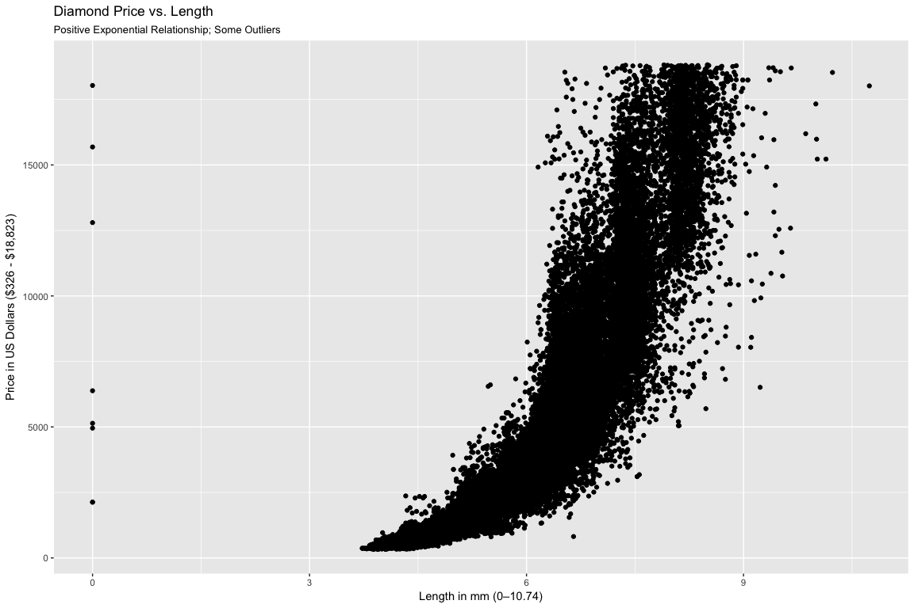
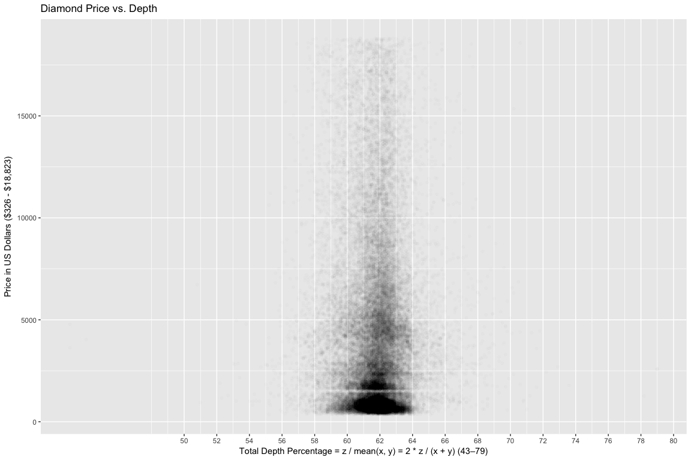
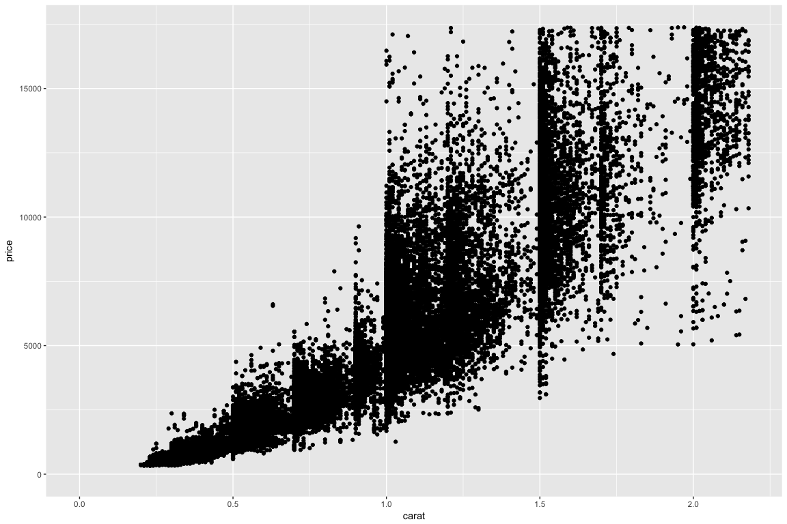
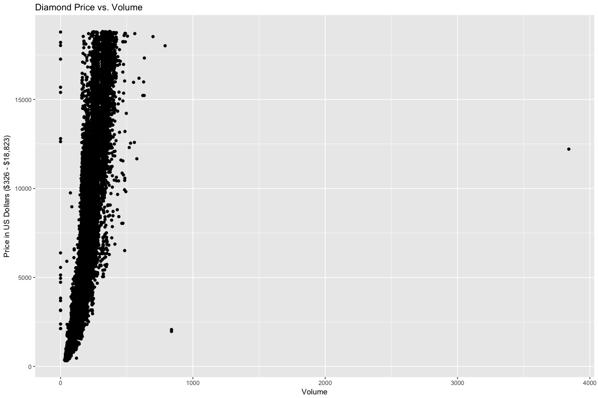
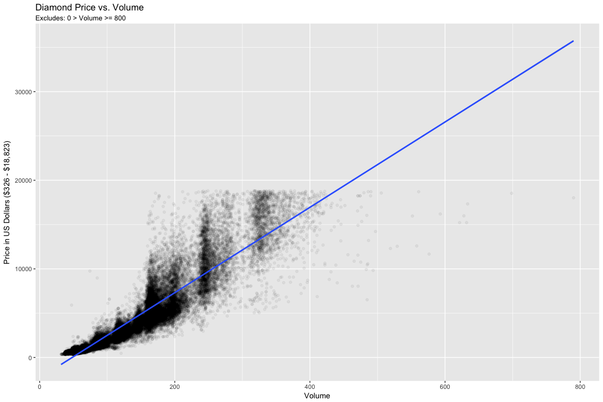
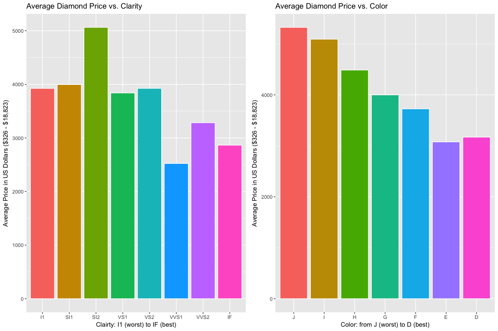

Lesson 6: Problem Set: Working with Two Variables
================
Josh Goldberg
October 15, 2017

#### **1. Price vs. Length**

In this problem set, you'll continue to explore the diamonds data set. Your first task is to create a scatterplot of price vs x using the ggplot syntax.

``` r
ggplot(aes(x = x, y = price), data = diamonds) +
  geom_point() +
  xlab("Length in mm (0–10.74)") +
  ylab("Price in US Dollars ($326 - $18,823)") +
  ggtitle("Diamond Price vs. Length", subtitle = "Positive Exponential Relationship; Some Outliers")
```



#### **2. Findings**

What are your observations about the scatterplot of price vs. x? There is an exponential positive relationship between price and length of a diamond. Most of the lengths fall between ~3 and ~6.5 mm. There are some diamonds outside the bulk that are a lower price relative to the rest of the diamonds.

#### **3. Correlations**

What is the correlation between price and x (length), price and y (width), price and z (depth in mm, which is different than total depth percentage)? Round to two decimals.

``` r
# Price vs. x
cor.test(diamonds$price, diamonds$x)
```

    ## 
    ##  Pearson's product-moment correlation
    ## 
    ## data:  diamonds$price and diamonds$x
    ## t = 440.16, df = 53938, p-value < 2.2e-16
    ## alternative hypothesis: true correlation is not equal to 0
    ## 95 percent confidence interval:
    ##  0.8825835 0.8862594
    ## sample estimates:
    ##       cor 
    ## 0.8844352

``` r
# Price vs. y
cor.test(diamonds$price, diamonds$y)
```

    ## 
    ##  Pearson's product-moment correlation
    ## 
    ## data:  diamonds$price and diamonds$y
    ## t = 401.14, df = 53938, p-value < 2.2e-16
    ## alternative hypothesis: true correlation is not equal to 0
    ## 95 percent confidence interval:
    ##  0.8632867 0.8675241
    ## sample estimates:
    ##       cor 
    ## 0.8654209

``` r
# Price vs. z
cor.test(diamonds$price, diamonds$z)
```

    ## 
    ##  Pearson's product-moment correlation
    ## 
    ## data:  diamonds$price and diamonds$z
    ## t = 393.6, df = 53938, p-value < 2.2e-16
    ## alternative hypothesis: true correlation is not equal to 0
    ## 95 percent confidence interval:
    ##  0.8590541 0.8634131
    ## sample estimates:
    ##       cor 
    ## 0.8612494

#### **4. Adjustments - Price vs. Depth**

Create a simple scatter plot of price vs depth.

``` r
ggplot(aes(x = depth, y = price), data = diamonds) +
  geom_point(alpha = 1/100) +
  xlab("Total Depth Percentage = z / mean(x, y) = 2 * z / (x + y) (43–79)") +
  ylab("Price in US Dollars ($326 - $18,823)") +
  ggtitle("Diamond Price vs. Depth") +
  scale_x_continuous(breaks = seq(50, 80, 2))
```



#### **5. Typical Depth Range**

Based on the scatterplot of price vs. depth, most diamonds are between what values of depth? 59-64.

#### **6. Correlation - Price vs. Depth**

What's the correlation of price vs. total depth percentage?

``` r
cor.test(diamonds$price, diamonds$depth)
```

    ## 
    ##  Pearson's product-moment correlation
    ## 
    ## data:  diamonds$price and diamonds$depth
    ## t = -2.473, df = 53938, p-value = 0.0134
    ## alternative hypothesis: true correlation is not equal to 0
    ## 95 percent confidence interval:
    ##  -0.019084756 -0.002208537
    ## sample estimates:
    ##        cor 
    ## -0.0106474

Based on the correlation coefficient would you use depth to predict the price of a diamond? Why? No, due to the correlastion coefficient (-0.0106474) being weak.

#### **8. Price vs. Carat**

Create a scatterplot of price vs carat and omit the top 1% of price and carat values.

``` r
ggplot(aes(x = carat, y = price), data = diamonds) +
  geom_point() +
  xlim(0, quantile(diamonds$carat, 0.99)) +
  ylim(0, quantile(diamonds$price, 0.99))
```



#### **9. Price vs. Volume**

Create a scatterplot of price vs. volume (x \* y \* z). This is a very rough approximation for a diamond's volume. Create a new variable for volume in the diamonds data frame. This will be useful in a later exercise. Don't make any adjustments to the plot just yet.

``` r
diamonds$volume <- with(diamonds, x * y * z)

ggplot(aes(x = volume, y = price), data = diamonds) +
  geom_point() +
  xlab("Volume") +
  ylab("Price in US Dollars ($326 - $18,823)") +
  ggtitle("Diamond Price vs. Volume")
```



#### **10. Findings - Price vs. Volume**

What are your observations from the price versus volume plot? There appears to essentially be no relationship. The data is stacked in a small range with some outliers.

#### **11. Correlations on Subsets**

What's the correlation of price and volume? Exclude diamonds that have a volume of 0 or that are greater than or equal to 800. Round to two decimals.

``` r
with(subset(diamonds, volume > 0 & volume < 800), 
            cor.test(price, volume))
```

    ## 
    ##  Pearson's product-moment correlation
    ## 
    ## data:  price and volume
    ## t = 559.19, df = 53915, p-value < 2.2e-16
    ## alternative hypothesis: true correlation is not equal to 0
    ## 95 percent confidence interval:
    ##  0.9222944 0.9247772
    ## sample estimates:
    ##       cor 
    ## 0.9235455

#### **12. Adjustments - Price vs. Volume**

Subset the data to exclude diamonds with a volume greater than or equal to 800. Also, exclude diamonds with a volume of 0. Adjust the transparency of the points and add a linear model to the plot. (See the Instructor Notes or look up the documentation of geom\_smooth() for more details about smoothers. We encourage you to think about this next question and to post your thoughts in the discussion section.

``` r
ggplot(aes(x = volume, y = price), 
       data = subset(diamonds, volume > 0 & volume < 800)) +
  xlab("Volume") +
  ylab("Price in US Dollars ($326 - $18,823)") +
  ggtitle("Diamond Price vs. Volume", subtitle = "Excludes: 0 > Volume >= 800") +
  geom_point(alpha = 0.05) +
  geom_smooth(method = "lm")
```



###### *12.1 Reflect*

Do you think this would be a useful model to estimate the price of diamonds? Why or why not? There seems to be a strong positive relationship between price and volume once outliers are excluded. But why are such outliers in existence? The answer could be telling of further details. Nonetheless, the majority of observations fall within a particularly linear ban of values based on price and volume. This essentially indicates that the bigger a diamond, the more expensive it costs, generally speaking. But there are clearly exceptions in the scatterplot to this rule. There may be a better alternative for predicting diamond prices.

#### **13. Mean Price by Clarity**

Use the function dplyr package to create a new data frame containing info on diamonds by clarity. Name the data frame diamondsByClarity.

The data frame should contain the following variables in this order:

       (1) mean_price
       (2) median_price
       (3) min_price
       (4) max_price
       (5) n

where n is the number of diamonds in each level of clarity.

``` r
diamondsByClarity <- diamonds %>%
  group_by(clarity) %>%
  summarise(mean_price = mean(price),
            median_price = median(price),
            min_price = min(price),
            max_price = max(price),
            n = n()) %>%
  arrange(clarity)
```

#### **14. Bar Charts of Mean Price**

We’ve created summary data frames with the mean price by clarity and color. You can run the code in R to verify what data is in the variables diamonds\_mp\_by\_clarity and diamonds\_mp\_by\_color.

Your task is to write additional code to create two bar plots on one output image using the grid.arrange() function from the package gridExtra.

``` r
diamonds_mp_by_clarity <- diamonds %>%
  group_by(clarity) %>%
  summarise(mean_price = mean(price)) %>%
  arrange(clarity)

diamonds_mp_by_color <- diamonds %>%
  group_by(color) %>%
  summarise(mean_price = mean(price)) %>%
  arrange(color)

diamonds_mp_by_color$color <- factor(diamonds_mp_by_color$color, 
                                     levels = c("J", "I", "H", "G", "F", "E", "D"))
diamonds_mp_by_clarity$clarity <- factor(diamonds_mp_by_clarity$clarity, 
                                     levels = c("I1", "SI1", "SI2", "VS1", "VS2", "VVS1", "VVS2", "IF" ))

plot1 <- ggplot(aes(x = clarity, y = mean_price, fill = clarity), data = diamonds_mp_by_clarity) +
  xlab("Clairty: I1 (worst) to IF (best)") +
  ylab("Average Price in US Dollars ($326 - $18,823)") +
  ggtitle("Average Diamond Price vs. Clarity") +
  geom_bar(colour = "white", stat = "identity") +
  guides(fill = FALSE)

plot2 <- ggplot(aes(x = color, y = mean_price, fill = color), data = diamonds_mp_by_color) +
  xlab("Color: from J (worst) to D (best)") +
  ylab("Average Price in US Dollars ($326 - $18,823)") +
  ggtitle("Average Diamond Price vs. Color") +
  geom_bar(colour = "white", stat = "identity") +
  guides(fill = FALSE)

grid.arrange(plot1, plot2, nrow = 1)
```



##### *15. Findings*

What do you notice in each of the bar charts for mean price by clarity and mean price by color? Mean price by clarity seems inconsistent with intuition; the better clarity diamonds have a lower mean price. Moreover, S12 has a spike in average price. Color holds the same pattern of inverse relationship between quality and price.

##### *16. Gapminder Revisited*

The Gapminder website contains over 500 data sets with information about the world's population. Your task is to continue the investigation you did at the end of Problem Set 3 or you can start fresh and choose a different data set from Gapminder.

If you’re feeling adventurous or want to try some data munging see if you can find a data set or scrape one from the web.

In your investigation, examine pairs of variable and create 2-5 plots that make use of the techniques from Lesson 4.

You can find a link to the Gapminder website in the Instructor Notes.

Once you've completed your investigation, create a post in the discussions that includes: 1. the variable(s) you investigated, your observations, and any summary statistics 2. snippets of code that created the plots 3. links to the images of your plots

###### *16.1 Download and Read Data*

``` r
# Download data from http://www.gapminder.org/data/

download.file('http://docs.google.com/spreadsheet/pub?key=pyj6tScZqmEfbZyl0qjbiRQ&output=xlsx', destfile = 'HIVprevalence.xlsx')

download.file('http://docs.google.com/spreadsheet/pub?key=0ArfEDsV3bBwCdHZJdFBhYVlvck43d1R6ZFYzUWpiLWc&output=xlsx', destfile = 'AnnualHIVdeaths.xlsx')

# Read data
HIVprev <- read_excel('HIVprevalence.xlsx')
HIVdeaths <- read_excel('AnnualHIVdeaths.xlsx')

# View structure and head
str(HIVprev)
```

    ## Classes 'tbl_df', 'tbl' and 'data.frame':    275 obs. of  34 variables:
    ##  $ Estimated HIV Prevalence% - (Ages 15-49): chr  "Abkhazia" "Afghanistan" "Akrotiri and Dhekelia" "Albania" ...
    ##  $ 1979.0                                  : num  NA NA NA NA NA ...
    ##  $ 1980.0                                  : num  NA NA NA NA NA NA NA NA NA NA ...
    ##  $ 1981.0                                  : num  NA NA NA NA NA NA NA NA NA NA ...
    ##  $ 1982.0                                  : num  NA NA NA NA NA NA NA NA NA NA ...
    ##  $ 1983.0                                  : num  NA NA NA NA NA NA NA NA NA NA ...
    ##  $ 1984.0                                  : num  NA NA NA NA NA NA NA NA NA NA ...
    ##  $ 1985.0                                  : num  NA NA NA NA NA NA NA NA NA NA ...
    ##  $ 1986.0                                  : num  NA NA NA NA NA NA NA NA NA NA ...
    ##  $ 1987.0                                  : num  NA NA NA NA NA NA NA NA NA NA ...
    ##  $ 1988.0                                  : logi  NA NA NA NA NA NA ...
    ##  $ 1989.0                                  : logi  NA NA NA NA NA NA ...
    ##  $ 1990.0                                  : num  NA NA NA NA 0.06 NA NA 0.5 NA NA ...
    ##  $ 1991.0                                  : num  NA NA NA NA 0.06 NA NA 0.8 NA NA ...
    ##  $ 1992.0                                  : num  NA NA NA NA 0.06 NA NA 1 NA NA ...
    ##  $ 1993.0                                  : num  NA NA NA NA 0.06 NA NA 1.2 NA NA ...
    ##  $ 1994.0                                  : num  NA NA NA NA 0.06 NA NA 1.4 NA NA ...
    ##  $ 1995.0                                  : num  NA NA NA NA 0.06 NA NA 1.6 NA NA ...
    ##  $ 1996.0                                  : num  NA NA NA NA 0.06 NA NA 1.7 NA NA ...
    ##  $ 1997.0                                  : num  NA NA NA NA 0.06 NA NA 1.8 NA NA ...
    ##  $ 1998.0                                  : num  NA NA NA NA 0.06 NA NA 1.8 NA NA ...
    ##  $ 1999.0                                  : num  NA NA NA NA 0.06 NA NA 1.9 NA NA ...
    ##  $ 2000.0                                  : num  NA NA NA NA 0.06 NA NA 1.9 NA NA ...
    ##  $ 2001.0                                  : num  NA NA NA NA 0.06 NA NA 1.9 NA NA ...
    ##  $ 2002.0                                  : num  NA NA NA NA 0.06 NA NA 1.9 NA NA ...
    ##  $ 2003.0                                  : num  NA NA NA NA 0.06 NA NA 1.9 NA NA ...
    ##  $ 2004.0                                  : num  NA NA NA NA 0.1 NA NA 1.9 NA NA ...
    ##  $ 2005.0                                  : num  NA NA NA NA 0.1 NA NA 1.9 NA NA ...
    ##  $ 2006.0                                  : num  NA NA NA NA 0.1 NA NA 1.9 NA NA ...
    ##  $ 2007.0                                  : num  NA NA NA NA 0.1 NA NA 1.9 NA NA ...
    ##  $ 2008.0                                  : num  NA NA NA NA 0.1 NA NA 2 NA NA ...
    ##  $ 2009                                    : chr  NA "0.06" NA NA ...
    ##  $ 2010                                    : chr  NA "0.06" NA NA ...
    ##  $ 2011                                    : chr  NA "0.06" NA NA ...

``` r
head(HIVprev)
```

    ## # A tibble: 6 x 34
    ##   `Estimated HIV Prevalence% - (Ages 15-49)` `1979.0` `1980.0` `1981.0`
    ##                                        <chr>    <dbl>    <dbl>    <dbl>
    ## 1                                   Abkhazia       NA       NA       NA
    ## 2                                Afghanistan       NA       NA       NA
    ## 3                      Akrotiri and Dhekelia       NA       NA       NA
    ## 4                                    Albania       NA       NA       NA
    ## 5                                    Algeria       NA       NA       NA
    ## 6                             American Samoa       NA       NA       NA
    ## # ... with 30 more variables: `1982.0` <dbl>, `1983.0` <dbl>,
    ## #   `1984.0` <dbl>, `1985.0` <dbl>, `1986.0` <dbl>, `1987.0` <dbl>,
    ## #   `1988.0` <lgl>, `1989.0` <lgl>, `1990.0` <dbl>, `1991.0` <dbl>,
    ## #   `1992.0` <dbl>, `1993.0` <dbl>, `1994.0` <dbl>, `1995.0` <dbl>,
    ## #   `1996.0` <dbl>, `1997.0` <dbl>, `1998.0` <dbl>, `1999.0` <dbl>,
    ## #   `2000.0` <dbl>, `2001.0` <dbl>, `2002.0` <dbl>, `2003.0` <dbl>,
    ## #   `2004.0` <dbl>, `2005.0` <dbl>, `2006.0` <dbl>, `2007.0` <dbl>,
    ## #   `2008.0` <dbl>, `2009` <chr>, `2010` <chr>, `2011` <chr>

``` r
str(HIVdeaths)
```

    ## Classes 'tbl_df', 'tbl' and 'data.frame':    269 obs. of  23 variables:
    ##  $ Annual number of AIDS deaths: chr  "Abkhazia" "Afghanistan" "Akrotiri and Dhekelia" "Albania" ...
    ##  $ 1990                        : num  NA 60 NA NA 60 NA NA 600 NA NA ...
    ##  $ 1991                        : num  NA 60 NA NA 60 NA NA 1200 NA NA ...
    ##  $ 1992                        : num  NA 60 NA NA 60 NA NA 1800 NA NA ...
    ##  $ 1993                        : num  NA 60 NA NA 60 NA NA 2500 NA NA ...
    ##  $ 1994                        : num  NA 60 NA NA 60 NA NA 3300 NA NA ...
    ##  $ 1995                        : num  NA 150 NA NA 60 NA NA 4300 NA NA ...
    ##  $ 1996                        : num  NA 150 NA NA 60 NA NA 5300 NA NA ...
    ##  $ 1997                        : num  NA 150 NA NA 60 NA NA 6300 NA NA ...
    ##  $ 1998                        : num  NA 150 NA NA 120 NA NA 7300 NA NA ...
    ##  $ 1999                        : num  NA 150 NA NA 120 NA NA 8200 NA NA ...
    ##  $ 2000                        : num  NA 150 NA NA 120 NA NA 9200 NA NA ...
    ##  $ 2001                        : num  NA 150 NA NA 300 NA NA 10000 NA NA ...
    ##  $ 2002                        : num  NA 150 NA NA 300 NA NA 11000 NA NA ...
    ##  $ 2003                        : num  NA 150 NA NA 300 NA NA 12000 NA NA ...
    ##  $ 2004                        : num  NA 350 NA NA 300 NA NA 12000 NA NA ...
    ##  $ 2005                        : num  NA 350 NA NA 600 NA NA 13000 NA NA ...
    ##  $ 2006                        : num  NA 350 NA NA 600 NA NA 13000 NA NA ...
    ##  $ 2007                        : num  NA 350 NA NA 600 NA NA 13000 NA NA ...
    ##  $ 2008                        : num  NA 350 NA NA 600 NA NA 12000 NA NA ...
    ##  $ 2009                        : num  NA 350 NA NA 600 NA NA 11000 NA NA ...
    ##  $ 2010                        : num  NA 350 NA NA NA NA NA NA NA NA ...
    ##  $ 2011                        : num  NA 350 NA NA NA NA NA NA NA NA ...

``` r
head(HIVdeaths)
```

    ## # A tibble: 6 x 23
    ##   `Annual number of AIDS deaths` `1990` `1991` `1992` `1993` `1994` `1995`
    ##                            <chr>  <dbl>  <dbl>  <dbl>  <dbl>  <dbl>  <dbl>
    ## 1                       Abkhazia     NA     NA     NA     NA     NA     NA
    ## 2                    Afghanistan     60     60     60     60     60    150
    ## 3          Akrotiri and Dhekelia     NA     NA     NA     NA     NA     NA
    ## 4                        Albania     NA     NA     NA     NA     NA     NA
    ## 5                        Algeria     60     60     60     60     60     60
    ## 6                 American Samoa     NA     NA     NA     NA     NA     NA
    ## # ... with 16 more variables: `1996` <dbl>, `1997` <dbl>, `1998` <dbl>,
    ## #   `1999` <dbl>, `2000` <dbl>, `2001` <dbl>, `2002` <dbl>, `2003` <dbl>,
    ## #   `2004` <dbl>, `2005` <dbl>, `2006` <dbl>, `2007` <dbl>, `2008` <dbl>,
    ## #   `2009` <dbl>, `2010` <dbl>, `2011` <dbl>

###### *16.2 Clean Data*

``` r
# Unload dplyr to avoid conflict
detach("package:dplyr", unload = TRUE)

# Rename country column
HIVprev <- rename(HIVprev, c('Estimated HIV Prevalence% - (Ages 15-49)' = 'Country'))
HIVdeaths <- rename(HIVdeaths, c('Annual number of AIDS deaths' = 'Country'))

# Reload dplyr
library(dplyr)

# Make tables narrow
HIVprev <- gather(HIVprev, "Year", "Estimated_Prevalence", -Country)
HIVdeaths <- gather(HIVdeaths, "Year", "Annual_Deaths", -Country)

# Subset data to excluded zeros and NA's
HIVprev_excludeZero <- HIVprev %>%
  subset(Estimated_Prevalence > 0) %>%
  subset(complete.cases(Estimated_Prevalence))
HIVdeaths_excludeZero <- subset(HIVdeaths, Annual_Deaths > 0)

# Change type after conversion to numeric
HIVprev_excludeZero$Year <- as.numeric(HIVprev_excludeZero$Year)
HIVprev_excludeZero$Estimated_Prevalence <- as.numeric(HIVprev_excludeZero$Estimated_Prevalence)
HIVdeaths_excludeZero$Year <- as.numeric(HIVdeaths_excludeZero$Year)

# Revisit structure and head
str(HIVprev_excludeZero)
```

    ## Classes 'tbl_df', 'tbl' and 'data.frame':    3301 obs. of  3 variables:
    ##  $ Country             : chr  "Angola" "Argentina" "Bahamas" "Barbados" ...
    ##  $ Year                : num  1979 1979 1979 1979 1979 ...
    ##  $ Estimated_Prevalence: num  0.0265 0.0205 0.01 0.0277 0.106 ...

``` r
head(HIVprev_excludeZero)
```

    ## # A tibble: 6 x 3
    ##     Country  Year Estimated_Prevalence
    ##       <chr> <dbl>                <dbl>
    ## 1    Angola  1979           0.02652787
    ## 2 Argentina  1979           0.02050798
    ## 3   Bahamas  1979           0.01000000
    ## 4  Barbados  1979           0.02767648
    ## 5  Botswana  1979           0.10597605
    ## 6    Brazil  1979           0.09447913

``` r
str(HIVdeaths_excludeZero)
```

    ## Classes 'tbl_df', 'tbl' and 'data.frame':    3132 obs. of  3 variables:
    ##  $ Country      : chr  "Afghanistan" "Algeria" "Angola" "Argentina" ...
    ##  $ Year         : num  1990 1990 1990 1990 1990 1990 1990 1990 1990 1990 ...
    ##  $ Annual_Deaths: num  60 60 600 3000 60 350 60 60 350 60 ...

``` r
head(HIVdeaths_excludeZero)
```

    ## # A tibble: 6 x 3
    ##       Country  Year Annual_Deaths
    ##         <chr> <dbl>         <dbl>
    ## 1 Afghanistan  1990            60
    ## 2     Algeria  1990            60
    ## 3      Angola  1990           600
    ## 4   Argentina  1990          3000
    ## 5     Armenia  1990            60
    ## 6   Australia  1990           350

``` r
# Left join HIVprev into HIVdeaths
HIVdf <- left_join(HIVdeaths_excludeZero, HIVprev_excludeZero, by = c("Country", "Year"))

# Remove rows with no HIVprev (NA's)
HIVdf <- HIVdf %>%
  subset(complete.cases(Estimated_Prevalence))
```

###### *16.3 Explore Data*

``` r
# Descriptive Statistics
summary(HIVdf)
```

    ##    Country               Year      Annual_Deaths    Estimated_Prevalence
    ##  Length:3048        Min.   :1990   Min.   :    60   Min.   : 0.060      
    ##  Class :character   1st Qu.:1995   1st Qu.:    60   1st Qu.: 0.100      
    ##  Mode  :character   Median :2000   Median :   350   Median : 0.300      
    ##                     Mean   :2000   Mean   :  9267   Mean   : 1.792      
    ##                     3rd Qu.:2005   3rd Qu.:  3900   3rd Qu.: 1.200      
    ##                     Max.   :2011   Max.   :390000   Max.   :26.500

``` r
cor(HIVdf$Annual_Deaths, HIVdf$Estimated_Prevalence)
```

    ## [1] 0.4775045

``` r
# Scatterplot
ggplot(aes(x = Estimated_Prevalence, y = Annual_Deaths), data = HIVdf) +
  xlab("HIV Estimated Prevalence, Ages 15-49") +
  ylab("Annual HIV Deaths All Ages") +
  ggtitle("HIV Annual Deaths vs. Estimated Prevalence") +
  geom_point() +
  geom_smooth(method = 'lm') +
  coord_trans(x = 'log10', y = 'log10')
```


